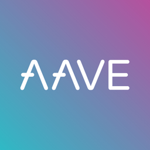

# DeFiwithPython

# Notes
## Fork Mainnet
```
brownie networks add development cl-hack cmd=ganache-cli host=http://127.0.0.1:8545 fork=https://eth-mainnet.g.alchemy.com/v2/R0TuBEIruJV4rhvgQErfc9Fhw5QeNwF_ accounts=10 mnemonic=brownie port=8545
brownie run scripts/aave_borrow.py

```
### Requirements
-  brownie
- nodejs
- ganache-cli
- aave_brownie_py
Put down collateral, Borrow, and repay a loan from Aave! Use this to short assets and accrue interest.


In our aave_borrow.py script, we do the following:

1. Approve our ETH to be swapped for WETH
2. Swap an amount of ETH for WETH
3. Using deposit_to_aave we deposit the WETH as collateral
4. We use that collateral to borrow DAI with borrow_erc20
5. Then, we pay it back!

We can view the txs on etherscan to see what's going on under the hood.